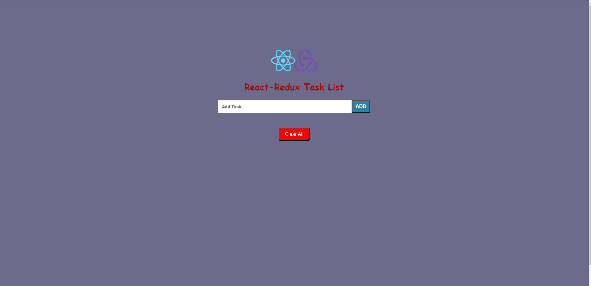

## Task List with React-redux

## Description
My motivation in this project is to develop a simple todo application with the react-redux library.

## Live Link
[Live](https://to-do-redux-zlh.vercel.app/)

## ScreenShot

## Technologies 

👉 React  
👉 Redux  
👉 CSS3   

## Usage..
⭐ You can add task.  
⭐ You can delete task.  
⭐ When the task is completed you can cross it off.  

